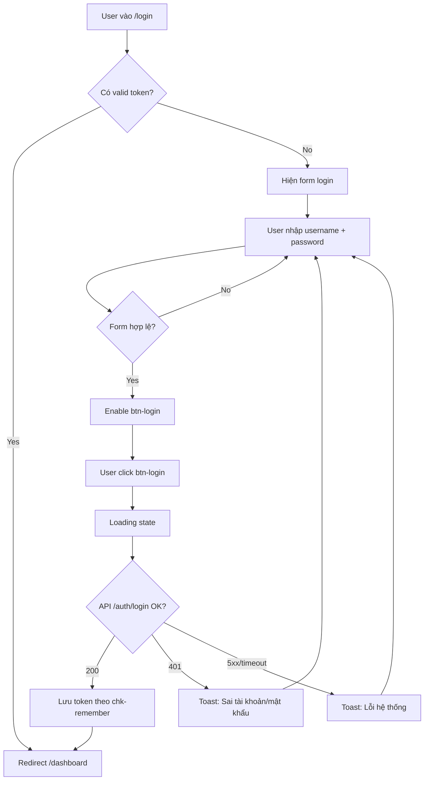

# 📄 Screen Design Document — `<Screen Name>`

> **Mục đích:** Mô tả UI + logic của 1 page (Web) / screen (Mobile) ở mức đủ để FE implement mà không cần hỏi lại BA.
> **Người điền:** BA — dựa trên Figma / ảnh design + skill BA.
> **Người đọc:** FE, QA, PM.

---

## 0. Metadata

| Field        | Value                                   |
| ------------ | --------------------------------------- |
| Screen ID    | `SCR-LOGIN`                             |
| Screen name  | Login                                   |
| Platform     | Web / Mobile / Both                     |
| Route / Path | `/login` (Web) · `LoginScreen` (Mobile) |
| Figma link   | <url>                                   |
| Version      | v1.0 — 2026-05-12                       |
| Author       | <BA name>                               |
| Related task | T-001                                   |

---

## 1. Sơ lược UI

Liệt kê các item xuất hiện trong design, gán `itemID` (kebab-case, prefix theo loại: `btn-`, `input-`, `txt-`, `img-`, `link-`, `chk-`, `sel-`…).

**Ví dụ:**

- `img-logo` — logo app, nằm top center.
- `txt-title` — tiêu đề "Đăng nhập", dưới logo.
- `input-username` — ô nhập username/email.
- `input-password` — ô nhập password, có icon toggle hiện/ẩn.
- `chk-remember` — checkbox "Ghi nhớ đăng nhập".
- `btn-login` — nút submit, horizontal center, dưới 2 input.
- `link-forgot` — link "Quên mật khẩu?", dưới `btn-login`.

---

## 2. Vị trí UI (Wireframe ASCII)

Vẽ layout bằng `itemID` để diễn tả vị trí tương đối.

```
||===============================================||
||                                               ||
||                  img-logo                     ||
||                  txt-title                    ||
||                                               ||
||              input-username                   ||
||              input-password                   ||
||                                               ||
||   chk-remember              link-forgot       ||
||                                               ||
||                 btn-login                     ||
||                                               ||
||===============================================||
```

---

## 3. Bảng UI items

> `Color` và `Component` **bắt buộc** lấy từ [.claude/design/tokens.json](../design/tokens.json) và [.claude/design/components.md](../design/components.md). Nếu chưa có → ghi `TBD` + note để FE/Design bổ sung.

| No. | Item name         | ItemID           | Color token    | Component  | State / Variant              | Note                          |
| --- | ----------------- | ---------------- | -------------- | ---------- | ---------------------------- | ----------------------------- |
| 1   | Logo              | `img-logo`       | —              | `Image`    | —                            | Asset: `logo.svg`             |
| 2   | Title             | `txt-title`      | `text.primary` | `Heading`  | h1                           | Text: "Đăng nhập"             |
| 3   | Input Username    | `input-username` | `neutral`      | `Input`    | default / error              | Placeholder: "Email"          |
| 4   | Input Password    | `input-password` | `neutral`      | `Input`    | default / error              | Type=password, có toggle      |
| 5   | Checkbox Remember | `chk-remember`   | `primary`      | `Checkbox` | checked / unchecked          | Default: unchecked            |
| 6   | Button Login      | `btn-login`      | `primary`      | `Button`   | enabled / disabled / loading | Disabled khi field rỗng       |
| 7   | Link Forgot       | `link-forgot`    | `text.link`    | `Link`     | —                            | Điều hướng `/forgot-password` |

---

## 4. Component states

| Component | Loading | Empty | Error | Disabled | Success |
| --------- | ------- | ----- | ----- | -------- | ------- |
| `<Name>`  | ...     | ...   | ...   | ...      | ...     |

---

## 5. Bảng Logic

> Mô tả hành vi của từng item / nhóm item. Nếu logic gọi API mà BE chưa cung cấp spec → đặt tên API tạm (VD `POST /auth/login`) và đánh dấu **[TBD-API]**, sẽ update khi có API doc.

| No. | Related itemID(s) | Trigger           | Description                                                                                               | API / Side-effect                |
| --- | ----------------- | ----------------- | --------------------------------------------------------------------------------------------------------- | -------------------------------- |
| 1   | `input-username`  | onChange / onBlur | Validate: not null/empty, format email. Hiện error dưới input nếu sai.                                    | —                                |
| 2   | `input-password`  | onChange / onBlur | Validate: not null/empty, min 8 ký tự.                                                                    | —                                |
| 3   | `btn-login`       | —                 | Chỉ `enabled` khi cả 2 input hợp lệ.                                                                      | —                                |
| 4   | `btn-login`       | onClick           | Gọi API login. Khi đang chờ → state `loading`. Thành công → redirect `/dashboard`. Fail → hiện toast lỗi. | `POST /auth/login` **[TBD-API]** |
| 5   | `chk-remember`    | onChange          | Nếu checked → lưu refresh token vào localStorage; nếu không → sessionStorage.                             | —                                |
| 6   | `link-forgot`     | onClick           | Điều hướng sang màn Forgot Password.                                                                      | Route `/forgot-password`         |

---

## 6. Logic xử lý thêm (lifecycle & edge cases)

### 6.1. Common (Web + Mobile)

| ID    | Tình huống                                   | Hành vi mong đợi                                                                   |
| ----- | -------------------------------------------- | ---------------------------------------------------------------------------------- |
| EC-01 | On mount                                     | Check token hiện có → nếu valid, auto redirect `/dashboard`, không hiện màn login. |
| EC-02 | Form auto-fill (browser/keychain)            | Cho phép, nhưng vẫn phải re-validate trước khi enable `btn-login`.                 |
| EC-03 | Submit khi nhấn Enter trong `input-password` | Tương đương click `btn-login`.                                                     |

### 5.2. Web-specific

| ID      | Tình huống                            | Hành vi mong đợi                                                                          |
| ------- | ------------------------------------- | ----------------------------------------------------------------------------------------- |
| EC-W-01 | Resize / responsive                   | Breakpoint `<768px` → layout 1 cột full-width; `≥768px` → form max-width 400px, căn giữa. |
| EC-W-02 | Tab navigation                        | Thứ tự focus: username → password → remember → forgot → login.                            |
| EC-W-03 | Browser back sau khi login thành công | Không cho quay lại màn login (replace history thay vì push).                              |
| EC-W-04 | Multi-tab                             | Nếu tab khác đã login (storage event) → tab hiện tại auto redirect `/dashboard`.          |
| EC-W-05 | Network offline                       | Disable `btn-login`, hiện banner "Mất kết nối mạng".                                      |
| EC-W-06 | API timeout (>10s)                    | Hủy request, hiện toast "Kết nối chậm, vui lòng thử lại".                                 |

### 5.3. Mobile-specific

| ID      | Tình huống              | Hành vi mong đợi                                                                            |
| ------- | ----------------------- | ------------------------------------------------------------------------------------------- |
| EC-M-01 | Background → Foreground | Nếu chưa login, giữ nguyên state form. Nếu đã có session valid → auto redirect.             |
| EC-M-02 | Network off → on        | Re-enable `btn-login` nếu form hợp lệ; hiện toast "Đã kết nối lại".                         |
| EC-M-03 | Blur → Refocus screen   | Giữ nguyên state form, không reload.                                                        |
| EC-M-04 | Keyboard                | Khi focus input → scroll để input không bị che; nhấn "Done" trên `input-password` → submit. |
| EC-M-05 | Biometric (nếu enabled) | Hiện prompt Face/Touch ID khi vào màn, success → auto login.                                |

---

## 6. Flow feature



## 7. Non-functional requirements

- **Performance**: ...
- **Security**: ...
- **i18n**: locale support, key naming theo `.claude/mobile/conventions/i18n-policy.md`
- **a11y**: WCAG AA, VoiceOver/TalkBack support

## 8. Actors & permissions

| Actor | Permission | Ghi chú |
| ----- | ---------- | ------- |
| ...   | ...        | ...     |

## 9. User stories

- **US-01**: As a `<role>`, I want `<action>`, so that `<benefit>`.
- **US-02**: ...

## 10. Acceptance criteria (Given/When/Then)

- **AC-01.1**: Given `<context>`, When `<action>`, Then `<outcome>`.
- **AC-01.2**: ...
- **AC-02.1**: ...

## 11. Business rules

- **BR-01**: ...
- **BR-02**: ...

---

### Ghi chú cho BA khi điền template

1. **Đặt itemID ngắn, có prefix loại** — FE dùng làm `data-testid` luôn được.
2. **Color/Component không có trong design system** → ghi `TBD` thay vì bịa.
3. **API chưa có spec** → đặt tên tạm + tag `[TBD-API]`, đừng bỏ trống.
4. **Wireframe ASCII** chỉ cần đúng vị trí tương đối, không cần tỉ lệ chính xác.
5. **Flowchart Mermaid** — nếu khó vẽ, có thể mô tả bằng bullet list các bước.
