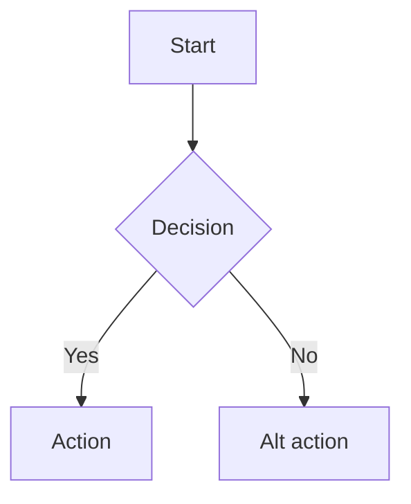

# Analyze — Business Analyst (BA)

Quy trình BA của phase Analysis
(Intake → **Analysis (BA → Fe)** → Plan → Implement → Review).

## Nguyên tắc cốt lõi

- **Context manifest là luật**: `00-intake/context-ba.md` của task liệt kê
  file BA được load. KHÔNG đọc file ngoài manifest (non-negotiable
  "Context manifest" trong AGENTS.md).
- Dùng thuật ngữ nhất quán theo `.claude/0-project/glossary.md`.
- Không suy diễn quá spec; chỗ thiếu/mơ hồ → mục "Open questions".
- Chỉ ghi vào `01-analysis/ba.md` — không sửa file intake hay file khác.

## Quy trình

1. Xác định `<task-id>` (vd `T-001`). Thiếu → hỏi user.
2. **Đọc context manifest**:
   `.claude/0-project/tasks/<task-id>/00-intake/context-ba.md`
   - Nếu rỗng/chưa tồn tại → DỪNG, báo cần điền `context-ba.md` trước
     (hoặc hỏi user danh sách file context).
3. Đọc đúng các file liệt kê trong manifest. Thường gồm:
   - `00-intake/parsed-spec/*` — spec đã parse (nguồn yêu cầu chính)
   - `00-intake/requirement.md` — tóm tắt yêu cầu
   - `.claude/0-project/glossary.md`, `project.md` — domain & thuật ngữ
   > Chỉ đọc nếu có trong manifest. Manifest quyết định, không phải gợi ý.
4. Phân tích nghiệp vụ: mục tiêu, actor, luồng, rule, ràng buộc.
5. Viết **acceptance criteria** có ID (`AC-01.1`, ...) — input bắt buộc
   cho role Fe và phase Plan.
6. Dựng **Phần B — Screen DD (delta)** theo
   `0-project/dd/screen-dd-template/screen-dd-template.md`: mỗi screen bị
   ảnh hưởng CHỈ ghi item/logic/edge-case/flow **có thay đổi** ở task này
   (mới/sửa/xoá). Phần không đổi → ghi `(không đổi)`, không chép lại.
7. Ghi ra `.claude/0-project/tasks/<task-id>/01-analysis/ba.md` theo cấu
   trúc bên dưới (ghi đè nếu đã có).

## Cấu trúc output `01-analysis/ba.md`

Output gồm 2 phần: **A** (phân tích nghiệp vụ, luôn có) và **B** (Screen
DD delta — chỉ ý CÓ THAY ĐỔI ở task này; phần không đổi ghi 1 dòng
`(không đổi)`).

````markdown
# BA Analysis — <task-id>

> Nguồn context: liệt kê file đã đọc theo context-ba.md
> Generated: <YYYY-MM-DD>

---

# Phần A — Phân tích nghiệp vụ

## A1. Mục tiêu nghiệp vụ

<Vì sao làm feature này, đo lường thành công bằng gì>

## A2. Flow chính



## A3. API dependency (nếu có)

| Endpoint | Method | Input | Output | Trạng thái       |
| -------- | ------ | ----- | ------ | ---------------- |
| `/...`   | GET    | ...   | ...    | rõ / chờ clarify |

### Điểm chưa rõ

- [ ] ...

## A4. Out of scope

- ...

## A5. Glossary additions

> Thuật ngữ mới đã append vào `.claude/glossary.md`.

- `<term>`: <định nghĩa ngắn>

## A6. Open questions / TBD

- Q1: ...

---

# Phần B — Screen DD (chỉ phần CHANGE)

> Theo screen-dd-template. Mỗi screen bị ảnh hưởng = 1 block.
> Chỉ liệt kê item/logic/edge-case THÊM/SỬA/XOÁ ở task này.
> Đánh dấu thay đổi: 🆕 mới · ✏️ sửa · 🗑️ xoá.
> Color/Component lấy từ design tokens/components; chưa có → `TBD`.
> API chưa có spec → tên tạm + `[TBD-API]`.

## Screen: `<SCR-ID>` — <tên> (🆕 mới | ✏️ sửa)

### B1. UI items thay đổi

| Δ   | ItemID  | Component | Color token | State/Variant    | Note |
| --- | ------- | --------- | ----------- | ---------------- | ---- |
| 🆕  | `btn-x` | `Button`  | `primary`   | enabled/disabled | ...  |

### B2. Wireframe (chỉ vẽ nếu layout đổi)

`(ASCII, hoặc ghi "layout không đổi")`

### B3. Component states thay đổi

| Component | Loading | Empty | Error | Disabled | Success |
| --------- | ------- | ----- | ----- | -------- | ------- |

### B4. Logic thay đổi

| Δ   | itemID | Trigger | Description | API / Side-effect |
| --- | ------ | ------- | ----------- | ----------------- |

### B5. Edge cases thay đổi (lifecycle)

| Δ   | ID  | Tình huống | Hành vi mong đợi |
| --- | --- | ---------- | ---------------- |

### B6. Flow feature (chỉ khi flow đổi)

### B7. User stories (mới ở task này)

- US-01: As a `<role>`, I want `<action>`, so that `<benefit>`.

### B8. Files dự kiến ảnh hưởng (delta)

| Δ   | Path                      | Vai trò |
| --- | ------------------------- | ------- |
| ✏️  | `src/pages/.../index.tsx` | ...     |

> Mỗi item/logic/AC phải map được tới AC ID ở Phần A5.
````

## Ràng buộc (non-negotiables)

- Không load file ngoài `context-ba.md`.
- Không tự quyết kỹ thuật/triển khai — chỉ phân tích nghiệp vụ.
- Mọi AC phải có ID duy nhất để Fe và Plan map lại được.
- Spec mâu thuẫn/thiếu → ghi Open questions, không tự bịa.
