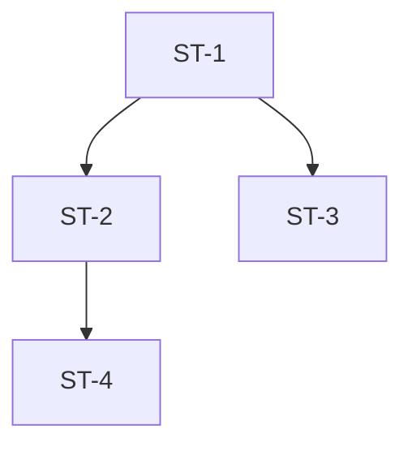

# Planning — lập kế hoạch trước khi implement

Sinh ra một **implementation plan dạng markdown** cho task, dựa trên kết quả
phân tích của role Fe. Plan là input bắt buộc cho phase Implement.

## Khi nào dùng

- User chạy `/plan <task-id>` hoặc yêu cầu lập kế hoạch trước khi code.
- Phase Analysis (BA → Fe) đã xong, trước khi phase Implement bắt đầu.

## Input bắt buộc — đọc trước khi làm

1. `.claude/0-project/tasks/<task-id>/01-analysis/fe.md` — phân tích Fe
   (component tree, state, navigation, API, AC mapping).
2. `.claude/0-project/tasks/<task-id>/01-analysis/dependencies-proposal.md`
   — package mới (nếu có). Mỗi DEP phải được tham chiếu trong plan.
3. `.claude/0-project/tasks/<task-id>/01-analysis/ba.md` — để lấy danh sách
   AC ID gốc, kiểm tra plan không bỏ sót AC.

> Nếu `fe.md` chưa được điền (còn template) → DỪNG, báo user chạy
> `/analyze <task-id> --role=fe` trước. Không tự suy diễn nội dung.

## Quy trình

1. Đọc 3 file input ở trên (dùng `<task-id>` user cung cấp, vd `T-001`).
2. Trích xuất: danh sách AC, component tạo mới vs reuse, state, API,
   dependencies mới.
3. Chia thành **sub-task** nhỏ, mỗi sub-task:
   - Độc lập commit được (`[<task-id>] <mô tả>`).
   - Có **scope lock**: danh sách file được phép sửa (allowlist).
   - Map tới ≥1 AC ID.
4. Xác định thứ tự + dependency giữa các sub-task (cái nào chặn cái nào).
5. Đối chiếu dependencies: sub-task nào dùng package mới phải ghi rõ DEP-ID
   và nhắc governance gate (§8) phải pass trước.
6. Kiểm tra coverage: mọi AC trong `ba.md` phải xuất hiện ở ≥1 sub-task.
7. Ghi output ra `.claude/0-project/tasks/<task-id>/02-plan/plan.md`
   theo template bên dưới (ghi đè nội dung cũ).

## Output template (`02-plan/plan.md`)

````markdown
# Implementation Plan — <task-id>

> Nguồn: 01-analysis/fe.md, dependencies-proposal.md, ba.md
> Generated: <YYYY-MM-DD>

## 1. Tóm tắt scope

- Screen mới: ...
- Screen sửa: ...
- Số sub-task: <N>
- Dependencies mới: <DEP-01, ...> hoặc "không"

## 2. Sub-tasks

### ST-1: <tên ngắn>

- **AC liên quan**: AC-01.1, AC-01.2
- **Mô tả**: ...
- **Scope lock (allowlist file)**:
  - `App/Containers/.../Foo.tsx`
  - `App/Components/Bar.tsx`
- **Depends on**: — (hoặc ST-x)
- **Dependencies mới**: DEP-01 (phải pass §8 trước) | không
- **Definition of Done**: ...
- **Commit**: `[<task-id>] <mô tả>`

### ST-2: ...

## 3. Thứ tự thực thi & dependency graph



## 4. AC coverage matrix

| AC ID   | Sub-task | Ghi chú |
| ------- | -------- | ------- |
| AC-01.1 | ST-1     |         |
| AC-01.2 | ST-1     |         |

> Mọi AC trong ba.md phải có hàng ở đây. Thiếu → plan chưa đạt.

## 5. Rủi ro & điểm cần quyết định

- ...

## 6. Pre-implement checklist

- [ ] Mọi AC được map vào sub-task
- [ ] Dependencies mới đã qua governance §8 (hoặc không có)
- [ ] Scope lock rõ ràng cho từng sub-task
- [ ] Dependency graph không có cycle
````

## Ràng buộc (non-negotiables)

- Chỉ ghi vào `02-plan/plan.md` — không sửa file analysis.
- Không tự cài hoặc tự duyệt package mới — chỉ tham chiếu DEP-ID.
- Mỗi sub-task phải commit độc lập, format `[<task-id>] <mô tả>`.
- Không bỏ sót AC: thiếu coverage thì plan KHÔNG hợp lệ.
- Không bịa nội dung khi input còn là template — yêu cầu hoàn tất Analysis trước.
