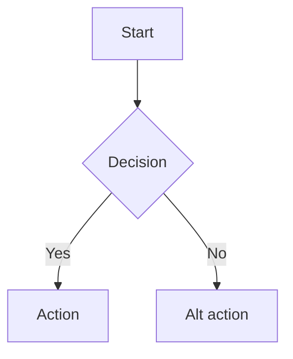

# BA Analysis

> Output của role BA. Input: `00-intake/normalized.md`, `.claude/glossary.md`.
> Mỗi AC/US/BR phải có ID để truy vết tới test và code.

## 1. Mục tiêu nghiệp vụ

<Vì sao làm feature này, đo lường thành công bằng gì>

## 2. Actors & permissions

| Actor | Permission | Ghi chú |
|---|---|---|
| ... | ... | ... |

## 3. User stories

- **US-01**: As a `<role>`, I want `<action>`, so that `<benefit>`.
- **US-02**: ...

## 4. Acceptance criteria (Given/When/Then)

- **AC-01.1**: Given `<context>`, When `<action>`, Then `<outcome>`.
- **AC-01.2**: ...
- **AC-02.1**: ...

## 5. Business rules

- **BR-01**: ...
- **BR-02**: ...

## 6. Flow chính

## 7. Edge cases & error states

| ID | Tình huống | Hành vi mong đợi |
|---|---|---|
| EC-01 | Mạng yếu | ... |
| EC-02 | Token hết hạn | ... |
| EC-03 | Empty data | ... |

## 8. Non-functional requirements

- **Performance**: ...
- **Security**: ...
- **i18n**: locale support, key naming theo `.claude/mobile/conventions/i18n-policy.md`
- **a11y**: WCAG AA, VoiceOver/TalkBack support

## 9. API dependency (nếu có)

| Endpoint | Method | Input | Output | Trạng thái |
|---|---|---|---|---|
| `/...` | GET | ... | ... | rõ / chờ clarify |

### Điểm chưa rõ

- [ ] ...

## 10. Out of scope

- ...

## 11. Glossary additions

> Thuật ngữ mới đã append vào `.claude/glossary.md`.

- `<term>`: <định nghĩa ngắn>
